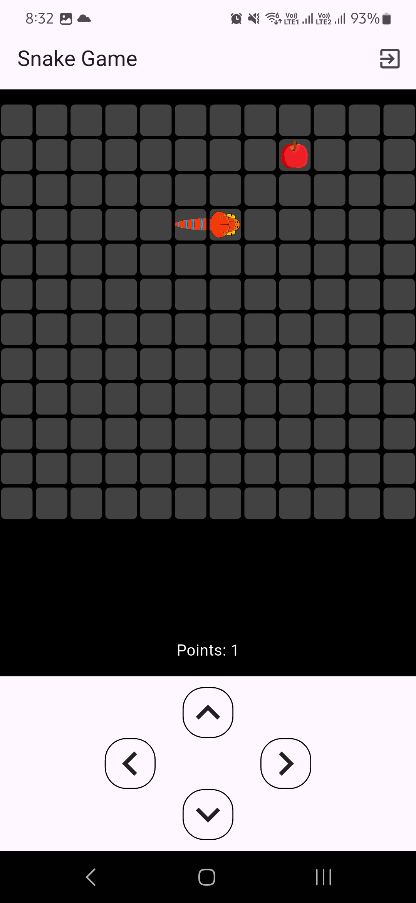

# Snake Game

Snake game built using Flutter where snake grows by eating food and dies when it collides with its own body.

Link to apk: https://drive.google.com/file/d/1vdrQUQythOsMZGSiBvYkdJZa_aUxrBhN/view?usp=sharing

## Features

- Directional buttons for controlling snake
- Snake grows after eating fruits
- Snake dies after colliding with itself
- Haptic feedback when clicking directional buttons

## Tools Used

- Flutter

## Screenshots

          
